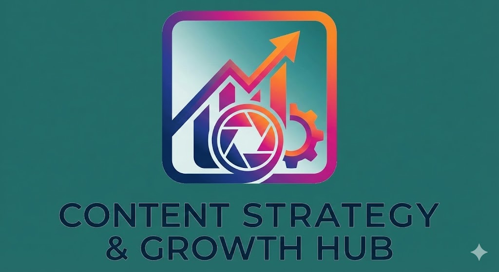

# 📸 Instagram Content Recommender & Analytics




## 📖 Project Overview

The **Instagram Content Recommender** is an end-to-end data science project designed to help content creators optimize their strategy. By analyzing historical Instagram data, this project provides actionable insights via a Tableau dashboard and utilizes Machine Learning models (ANN & XGBoost) to predict the reach and engagement (Likes) of future posts based on content type, timing, and category.

Additionally, the application integrates **Google Gemini AI** to provide qualitative strategy advice based on the model's numerical predictions.

## 📂 Repository Structure

```text
├── App.py                       # Streamlit Application (AI Strategist & Predictor)
├── Images/                      # Project assets, diagrams, and logos
├── Models/                      # Saved ML models (.h5, .pkl) and Encoders
├── Scripts-ML/                  # Jupyter Notebooks for EDA, Training, and Prediction
├── SQL-Scripts/                 # SQL scripts for data profiling and insights
├── Tableau-Dashboard/           # Tableau workbooks and analytics screenshots
├── Splitted-Data/               # Train/Test CSV datasets
├── instagram-analytics-dataset/ # Raw dataset
└── requirements.txt             # Python dependencies
